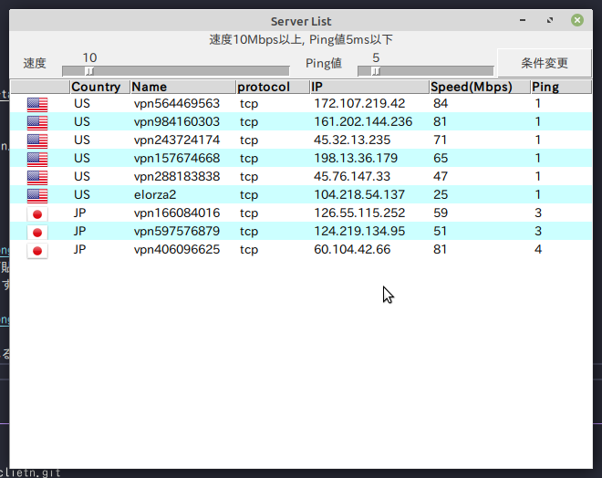
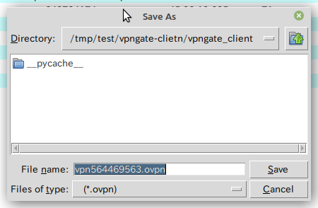

# vpngate-clietn

VPNGateよりOpenVPN接続のための定義ファイルを取得するためのクライアント  
簡易なコネクションチェック及び回線速度とPing値でのフィルタが掛けられるため  
稼働中で有能なサーバを選択しやすくするために作成した

## 実行方法

```bash
$ git clone https://github.com/tantan-tanuki/vpngate-clietn.git
$ cd vpngate-client
$ poetry install
$ poetry run python vpngate-clietn/main.py
```

## 使い方

起動時に[VPNGateサーバ](https://www.vpngate.net/ja/)からサーバリストを取得し  
リスト内のサーバに対してコネクションが貼れるかのチェックを行っているため  
その間、以下の画面がしばらく表示されます


ロードが完了すると以下の画面が表示されます  
画面上部のスライダーにより回線速度及びPing値を変更し  
条件変更ボタンを押せば設定に従ったサーバに絞り込めます

)

欲しい条件に合致したサーバをリストよりダブルクリックすれば  
OpenVPN接続用のファイルを保存するダイアログが表示されますので  
保存場所とファイル名を指定して保存して下さい

)

# 謝辞

国旗アイコン画像は以下のサイトから拝借しました  
http://www.icondrawer.com

スプラッシュ画像は以下のサイトから拝借しました  
http://www.irasutoya.com
